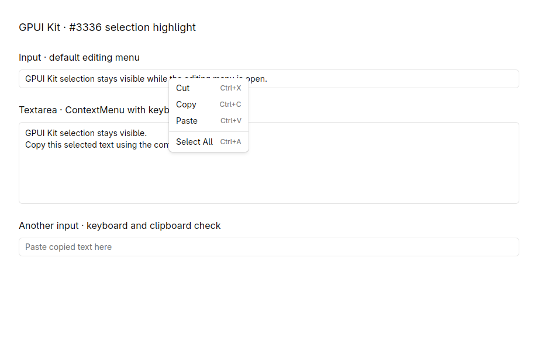
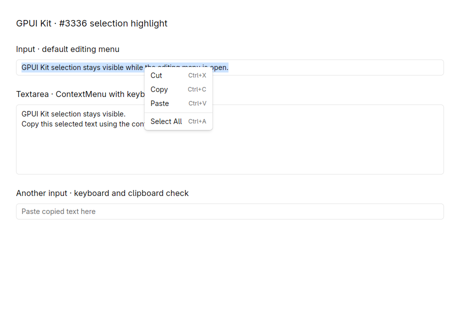
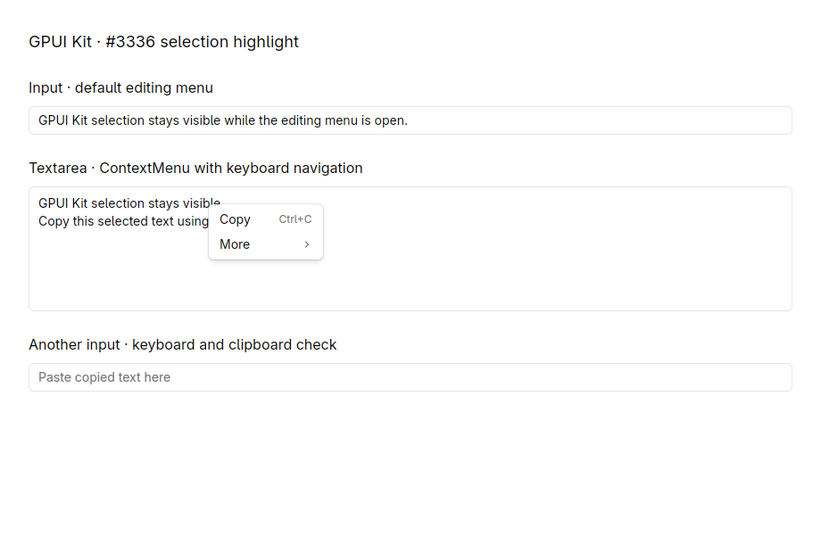
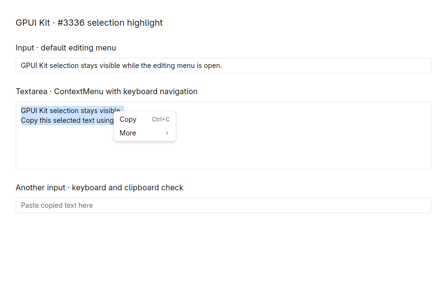
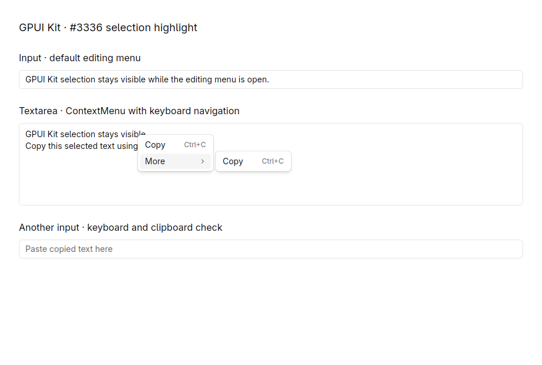
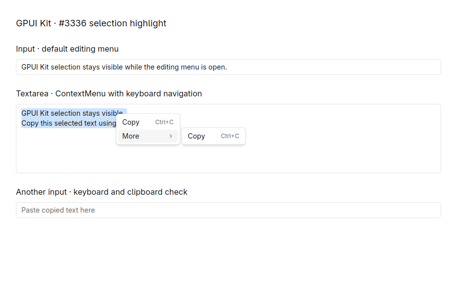

# Issue #3336 native verification

Code under review: [3ac851b3](https://github.com/lurenjia534/gpui-component/commit/3ac851b3812758b2c66158d41b4e64474bfe41a5). Baseline: [c0bebdc8](https://github.com/longbridge/gpui-kit/commit/c0bebdc8a8cf9a74f9f52feaca278a52a9cfcca2).

These files are validation evidence only. This separate branch is not part of the code PR.

## Automated checks

- `script/test-input`: 575 passed, 0 failed.
- `cargo test -p gpui-kit --features test-support --test menu --locked`: 4 passed, 0 failed.
- `cargo fmt --check` and `git diff --check`: passed.

Coverage includes selection paths after the menu has focus, weak-handle expiration, reused menus, input ownership, menu replacement, submenus, Escape, Copy, unrelated menus, and typing into another input.

## Native desktop checks

The same [temporary application](native-fixture.rs) was built against both commits. It uses the production Input, Textarea, ContextMenu and PopupMenu implementations, Kit initialization and Kit's window helper. It was not a Story Gallery build and is not added to the code PR.

Platform: Linux/KDE Wayland desktop, with GPUI using native X11 through XWayland. Mouse and keyboard input used KWin EIS/libei. Each image is a direct capture of the actual 920 x 620 native client window.

| Scenario | Before | After |
| --- | --- | --- |
| Input default editing menu |  |  |
| Textarea context menu |  |  |
| Textarea submenu |  |  |

All three scenarios lost the highlight before the fix and retained it after the fix. Menu ownership and keyboard focus were also checked:

- Clicking Copy replaced a known clipboard sentinel with the exact selected multiline text.
- Pasting into the other Input produced the expected text, with its normal single-line newline normalization.
- Clicking the other Input dismissed the menu; typed text and the copy shortcut then targeted that Input.
- Opening More by pointer hover and pressing Escape dismissed the submenu chain; Ctrl+C then copied the source selection, confirming restored focus.

The automated menu test separately covers keyboard submenu navigation. macOS and Windows native behavior was not exercised in this run. Completion/code-action overlays were not changed or verified.

## Reproduce

Create detached worktrees at the two commits above. In each, replace `examples/input/src/main.rs` with [native-fixture.rs](native-fixture.rs), then run `cargo run -p input --locked` on a desktop session.

1. Select text in the first Input and open its right-click editing menu.
2. Select both lines in the Textarea and open its context menu; hover More to open the submenu.
3. Compare selection visibility, then use Copy and paste into the destination Input.
4. Repeat with Escape and with clicking the destination while the source menu is open; verify subsequent keyboard input targets the expected control.

[verification.json](verification.json) records fixture, binary, patch and screenshot hashes and the measured native results. Implementation and validation were AI-assisted.
